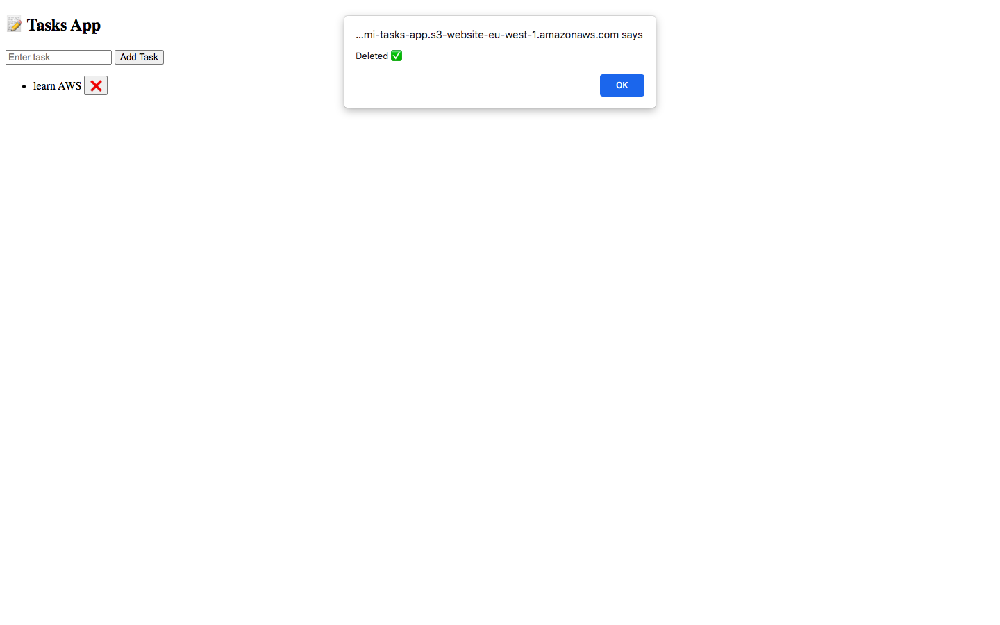

# 🚀 Serverless Tasks App (AWS)

A full-stack serverless web application built using AWS services.

---

## 🌍 Live Demo
http://jolomi-tasks-app.s3-website-eu-west-1.amazonaws.com

---

## 📸 Screenshots

### ➕ Add Task

### ⌨️ Entered Task

### 📋 Task List

### ❌ Delete Task

---

## 🛠️ Tech Stack

- Amazon API Gateway (REST API)
- AWS Lambda (Python backend)
- Amazon DynamoDB (NoSQL database)
- Amazon S3 (Frontend hosting)

---

## ⚙️ Features

- ✅ Create tasks
- ✅ View tasks
- ✅ Delete tasks
- ✅ Fully serverless architecture

---

## 🧠 What I Learned

- Building REST APIs with API Gateway
- Connecting Lambda with DynamoDB
- Handling CORS issues (real-world debugging)
- Writing secure IAM policies
- Deploying frontend using S3

---

## 📂 Project Structure

aws-serverless-tasks-app/ │ ├── index.html ├── README.md └── images/ ├── add-task.png ├── entered-task.png ├── adding-task.png └── delete-task.png

## 📌 Author

*Jolomi Ayu*

---

## ⭐ Future Improvements

- Add authentication (AWS Cognito)
- Add update task feature (UI)
- Improve UI design
